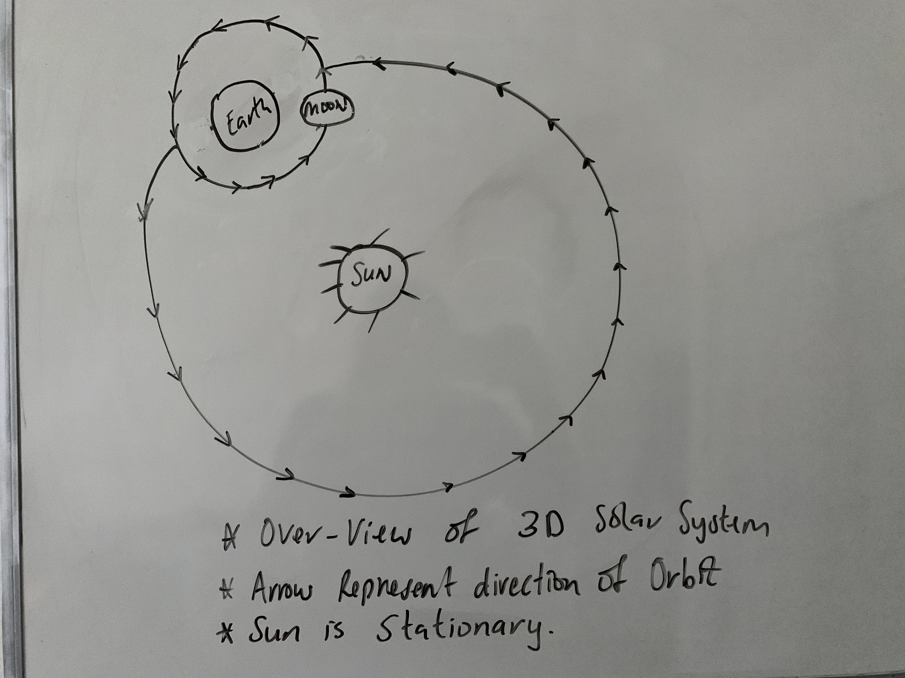
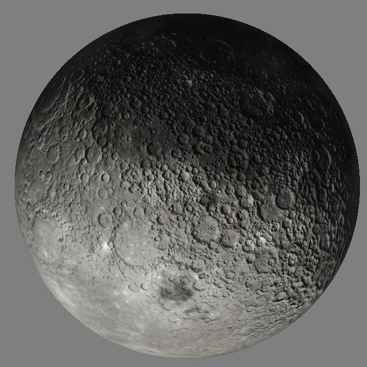
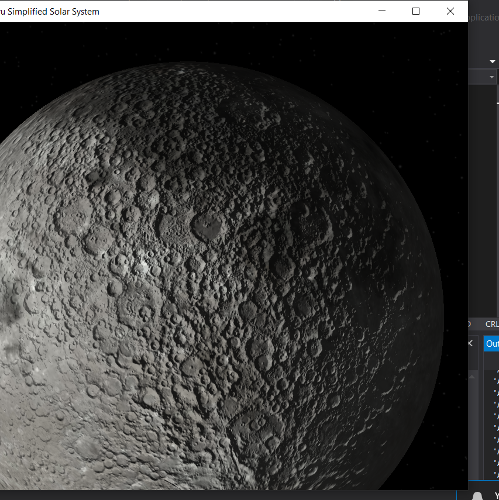

# SEMGraphicSimulator
Simplified computer graphic simulation of the solar to earth moon system

Video Link:

## Objective
The goal of the project was to create a simplified solar system that showcases the Moon, Earth,
and the Sun. In this system both planets will be rotating around their own axis with the moon
orbiting around the Earth; Both Moon and Earth will be transformed to their respective scale. The other secondary objective involved, the planets having
textures, and bump mapped, the camera can move forward, backwards, left and right
directions. Finally, there is a night sky as the background.
Below is the original image sketch of the goal.

### Project Highlights/Retrospective
The project provides a good learning opportunity, to practice concepts that were covered
during the computer graphic course, that I tried to implement. They range from the understanding the GPU Pipeline, Meshes, applying Transformations/ Matrices, Texture, Camera, Bump Mapping, AntiAliasing, Phong Shading & Lightning, and much more. It also serves a good place to get
creative.
There were several improvements and features, that could have been made or added, that
include music, shadows, tessellation or perhaps adding another planet. Overall, the initial
and to some extent the secondary objectives were completed and I am proud of the results

### Moon Bump Mapping Samples
| Sample 1 | Sample 2 |
| ------ | ------ |
|  |  |
